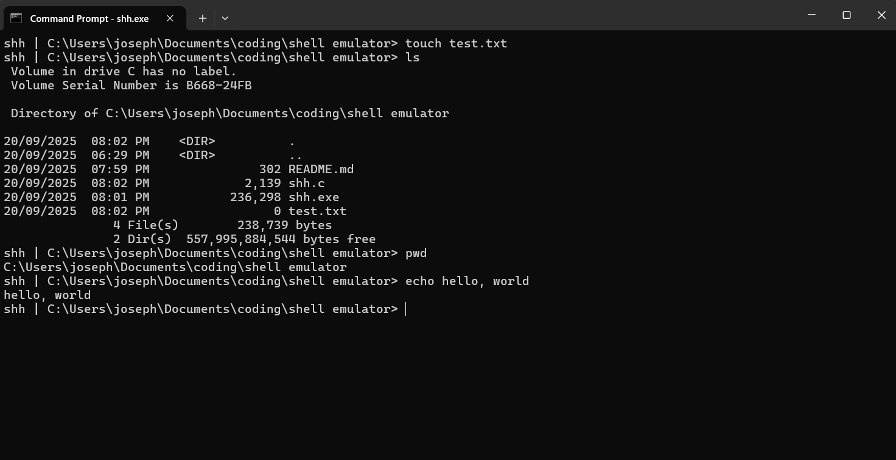

# shh
mini-shell for windows made in c, used it to learn a bit of c

## features
runs all windows commands, aliases for pwd, touch, cat, clear and ls

## how to build
download project, can either just run the exe through cmd, shell will open
or you can use gcc to compile shh.c and run that

